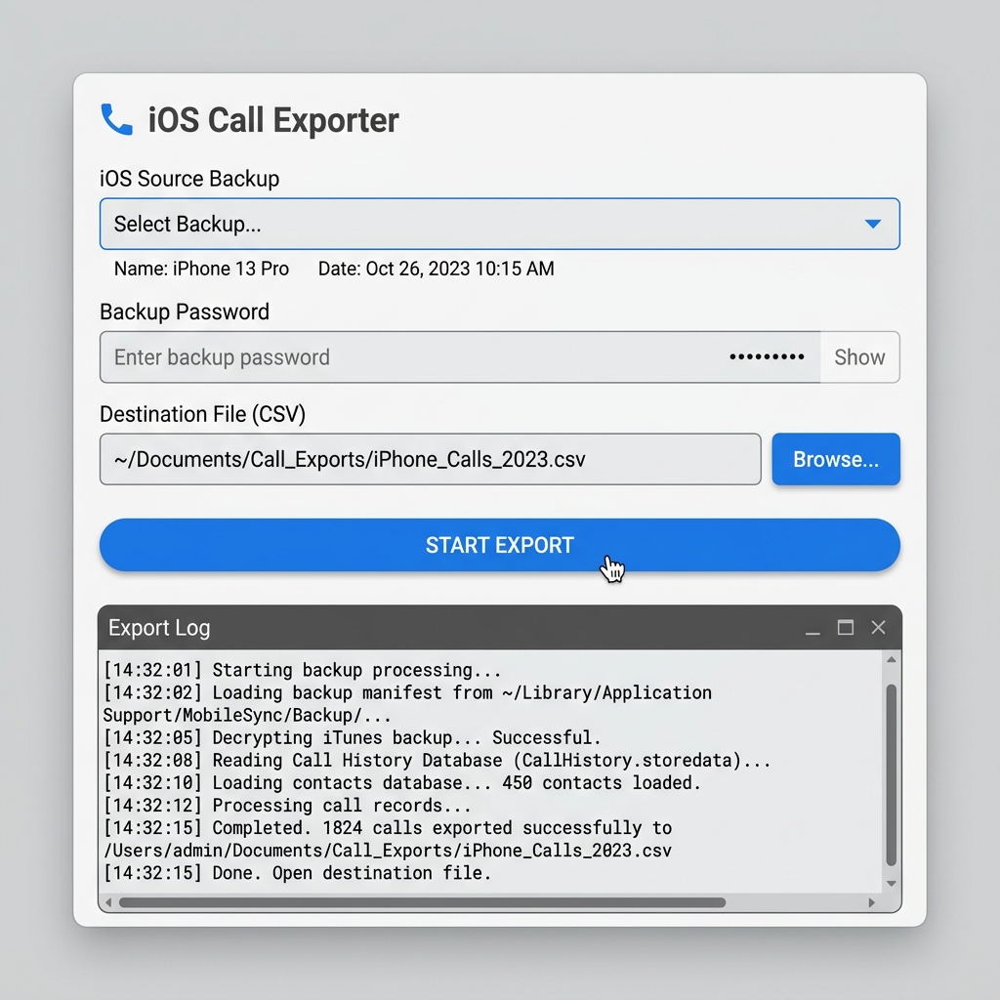
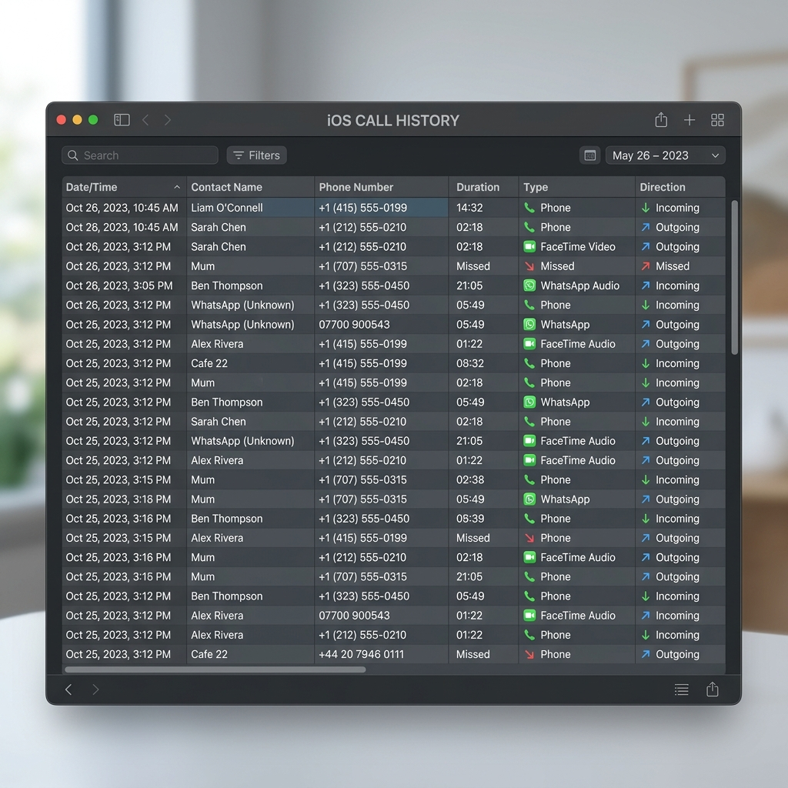

# ios-call-export

<p align="center">
  
  
  
  
</p>

---

### Language / Lingua
* [🇺🇸 English Version](#-english-version)
* [🇮🇹 Versione Italiana](#-versione-italiana)

---

## 🇺🇸 English Version

Export iPhone call history from an encrypted local iTunes/macOS backup to CSV. This tool automatically retrieves and decrypts your backups, matches call entries with contact names from your address book, parses international phone numbers, resolves duration, and supports third-party VoIP apps like WhatsApp, Microsoft Teams, FaceTime, and others.

### 📸 Demo & Preview
#### 🖥️ Graphical User Interface (GUI)
Below is the modern desktop interface that scans for backups, accepts your passphrase, and exports call history in one click:
<p align="center">
  
</p>

#### 📊 Exported CSV Spreadsheet Output
The exported CSV database includes detailed fields, readable dates, formatted durations, and carrier country prefixes:
<p align="center">
  
</p>

---

### ✨ Features
- **Automatic Backup Location**: Searches system paths automatically to find local iPhone backups.
- **Passphrase Decryption**: Seamlessly decrypts backup files on-the-fly. (iOS requires backups to be encrypted to include call records).
- **Contact Name Resolution**: Extracts matching names from `AddressBook.sqlitedb`.
- **FaceTime & VoIP Support**: Detects and labels FaceTime, WhatsApp, Teams, and standard carrier calls.
- **Rich CSV Export**: Formats data with local timezone timestamps, carrier ISO country codes, prefixes, national format numbers, and human-readable durations.
- **Excel Formatting Option**: Allows formatting optimization specifically for Microsoft Excel (preventing scientific notation on numbers and using proper delimiters).
- **Google Calendar Sync Integration**: Webhook-ready script to sync call logs to Google Calendar events with built-in deduplication.

---

### 🛠️ Prerequisites & Installation
1. **Prerequisites**:
   - macOS, Windows, or Linux with a local iOS backup.
   - Python **3.14+**
   - [uv](https://docs.astral.sh/uv/) (Fast Python package manager)

2. **Creating an encrypted backup**:
   - Connect your iPhone to your Mac/PC.
   - Open **Finder** (macOS) or **iTunes** (Windows), select your iPhone in the sidebar.
   - Check **Encrypt local backup** and set a passphrase (write it down or save it!).
   - Click **Back Up Now** and wait.
   *Backups are typically stored in `~/Library/Application Support/MobileSync/Backup/` on macOS.*

3. **Clone and Install**:
   ```bash
   git clone <this-repo>
   cd ios-call-export
   uv sync
   ```

---

### 🚀 Usage
#### 🖥️ Desktop GUI (Graphical User Interface)
To run the visual app, use:
```bash
uv run python gui.py
```
This launches a desktop window that auto-detects your local backups, lets you input your passphrase, choose the output file, and exports everything with one click.
*(On Linux, ensure you have Tkinter installed: `sudo apt install python3-tk` / `sudo dnf install python3-tkinter`).*

#### 💻 CLI (Command Line Interface)
To run the terminal script, use:
```bash
uv run python export_calls.py
```
By default, this script auto-detects the most recent backup and outputs `calls.csv`.

**CLI Options:**
```text
--backup-dir PATH    Path to a specific backup directory
--output, -o PATH    Output CSV path (default: calls.csv)
--passphrase TEXT    Backup encryption passphrase
--excel              Format CSV specifically for Excel (semicolon separator, text-formatted numbers)
```

---

### 🔑 Passphrase Configuration
You can configure your password in several ways. The script checks for the passphrase in this order:
1. `--passphrase` command line argument
2. `BACKUP_PASSPHRASE` environment variable in `.env`
3. `OP_BACKUP_REF` (1Password CLI reference) environment variable in `.env`
4. macOS Keychain key (`ios-backup-passphrase`)
5. Interactive user prompt

#### To use `.env` or macOS Keychain:
1. Copy the example environment file:
   ```bash
   cp .env.example .env
   ```
2. Edit `.env` and uncomment/configure `BACKUP_PASSPHRASE` or `OP_BACKUP_REF`.
3. To store in macOS Keychain (recommended for unattended/cron runs):
   ```bash
   security add-generic-password -a "$USER" -s "ios-backup-passphrase" -w
   ```

---

### 📋 CSV Schema Definition

| Column | Description |
|---|---|
| `id` | Database primary key |
| `unique_id` | Stable UUID for the call record |
| `start` | Call start time (`YYYY-MM-DD HH:MM:SS`) |
| `end` | Call end time (`YYYY-MM-DD HH:MM:SS`) |
| `contact_name` | Resolved contact name from AddressBook |
| `phone_number` | Raw phone number or email (for FaceTime) |
| `country_prefix` | International country prefix (e.g. `+39`) |
| `national_number` | National/local phone number without prefix |
| `phone_country` | Country name resolved from phone number prefix |
| `duration` | Human-readable duration (`HH:MM:SS`) |
| `duration_seconds` | Duration as integer seconds |
| `direction` | `Incoming`, `Outgoing`, or `Missed` |
| `call_type` | `Phone`, `FaceTime Video`, `FaceTime Audio`, or app name (e.g. `Whatsapp`) |
| `answered` | `True` or `False` |
| `country_code` | ISO country code of carrier/roaming location (e.g. `DE`) |
| `service_provider` | Bundle ID of the calling service |
| `location` | Location string if available |

---

### ⚙️ Google Calendar Sync
You can automatically sync answered calls to your Google Calendar using the webhook script.
1. Configure your calendar webhook inside `.env`:
   ```env
   WEBHOOK_URL=https://your-instance.com/webhook/your-webhook-path
   ```
2. Send the call records:
   ```bash
   uv run python send_to_webhook.py            # Send all answered calls
   uv run python send_to_webhook.py --weeks 4  # Send calls from the last 4 weeks
   uv run python send_to_webhook.py --dry-run  # Dry run preview (does not send)
   ```
*Calls are deduplicated on Google Calendar using the unique `unique_id` as the calendar event ID.*

---

### ⚠️ Limitations
- **History Retention**: Call logs are only kept for as long as iOS stores them on the device (typically up to ~1 year/1000 calls).
- **Deleted Contacts**: Names cannot be resolved for contacts deleted prior to the backup unless stored in `ZNAME` within the database.
- **Group FaceTime Calls**: iOS does not store participants in the main record table, so phone numbers/contacts for group FaceTime calls may be empty.
- **Backup Encryption Requirement**: You **must** enable "Encrypt local backup" in Finder/iTunes; Apple excludes call history database files from unencrypted backups for privacy reasons.

---
---

## 🇮🇹 Versione Italiana

Esporta la cronologia delle chiamate dell'iPhone da un backup locale crittografato di iTunes/macOS in formato CSV. Questo strumento individua e decrittografa automaticamente i backup, associa i record delle chiamate ai contatti della tua rubrica telefonica, analizza i prefissi internazionali, calcola la durata e supporta chiamate da app di terze parti (come WhatsApp, Microsoft Teams, FaceTime e altre).

### 📸 Demo e Anteprima
#### 🖥️ Interfaccia Grafica (GUI)
Ecco l'interfaccia desktop moderna che rileva i backup sul sistema, richiede la password ed esporta tutto in un clic:
<p align="center">
  
</p>

#### 📊 Esempio di File CSV Esportato
Il file CSV generato include campi dettagliati, orari formattati, durate leggibili e prefissi internazionali dei contatti:
<p align="center">
  
</p>

---

### ✨ Funzionalità
- **Individuazione Automatica del Backup**: Cerca automaticamente le cartelle di backup dell'iPhone nel sistema.
- **Decrittografia in Locale**: Sblocca i database crittografati direttamente sulla tua macchina. (La crittografia del backup è obbligatoria per far sì che iOS includa la cronologia chiamate).
- **Risoluzione Nomi Rubrica**: Recupera i nomi associati ai numeri o email estraendoli da `AddressBook.sqlitedb`.
- **Supporto FaceTime e Chiamate VoIP**: Riconosce ed etichetta correttamente FaceTime, WhatsApp, Teams e chiamate di rete fissa/mobile.
- **Danti Completi ed Estesi**: Include data locale, prefisso telefonico, nazione del contatto, nazione di roaming del telefono, durata e stato (risposta/non risposta).
- **Formato Compatibile con Excel**: Opzione per salvare il CSV in formato ottimizzato per Excel (separatore punto e virgola `;` e numeri di telefono formattati come testo per evitarne l'alterazione).
- **Sincronizzazione Google Calendar**: Script pronto all'uso per inviare i dati a un webhook che crea eventi in Google Calendar, evitando duplicati.

---

### 🛠️ Prerequisiti e Installazione
1. **Requisiti di Sistema**:
   - macOS, Windows o Linux con un backup iOS locale.
   - Python **3.14+**
   - [uv](https://docs.astral.sh/uv/) (Gestore di pacchetti Python ultra veloce)

2. **Creare un backup crittografato**:
   - Collega l'iPhone al Mac o PC.
   - Apri il **Finder** (macOS) o **iTunes** (Windows) e seleziona il tuo iPhone nella barra laterale.
   - Seleziona **Crittografa backup locale** e inserisci una password (conservala!).
   - Clicca su **Effettua backup adesso** e attendi il completamento.
   *Su macOS i backup sono salvati in `~/Library/Application Support/MobileSync/Backup/`.*

3. **Clonare il repository ed installare**:
   ```bash
   git clone <this-repo>
   cd ios-call-export
   uv sync
   ```

---

### 🚀 Utilizzo
#### 🖥️ Interfaccia Grafica Desktop (GUI)
Per avviare l'applicazione visiva, esegui:
```bash
uv run python gui.py
```
Questo comando apre una finestra in cui potrai selezionare il backup, inserire la password, scegliere dove salvare il file CSV e avviare l'esportazione con un clic.
*(Su Linux, assicurati che sia installato Tkinter: `sudo apt install python3-tk` o `sudo dnf install python3-tkinter`).*

#### 💻 Interfaccia a Linea di Comando (CLI)
Per eseguire lo script da terminale:
```bash
uv run python export_calls.py
```
Lo script rileverà automaticamente il backup più recente e salverà l'esportazione in `calls.csv`.

**Opzioni CLI disponibili:**
```text
--backup-dir PATH    Percorso di una cartella di backup specifica
--output, -o PATH    Percorso del file CSV di output (default: calls.csv)
--passphrase TEXT    Password del backup crittografato
--excel              Formatta il CSV per Excel (separatore punto e virgola, numeri come testo)
```

---

### 🔑 Configurazione Password di Backup
La password viene cercata automaticamente seguendo questo ordine di priorità:
1. Argomento CLI `--passphrase`
2. Variabile d'ambiente `BACKUP_PASSPHRASE` nel file `.env`
3. Variabile d'ambiente `OP_BACKUP_REF` (integrazione CLI di 1Password) nel file `.env`
4. Portachiavi di macOS (Keychain) sotto la voce `ios-backup-passphrase`
5. Richiesta interattiva da terminale

#### Come usare il file `.env` o il Portachiavi macOS:
1. Copia il file di esempio:
   ```bash
   cp .env.example .env
   ```
2. Modifica il file `.env` decommentando e inserendo la password in `BACKUP_PASSPHRASE` o il link di 1Password in `OP_BACKUP_REF`.
3. Per memorizzare la password in Keychain (consigliato per script cron/automatici):
   ```bash
   security add-generic-password -a "$USER" -s "ios-backup-passphrase" -w
   ```

---

### 📋 Struttura Campi CSV

| Colonna | Descrizione |
|---|---|
| `id` | Chiave primaria del database |
| `unique_id` | UUID univoco e stabile del record di chiamata |
| `start` | Orario inizio chiamata (`YYYY-MM-DD HH:MM:SS`) |
| `end` | Orario fine chiamata (`YYYY-MM-DD HH:MM:SS`) |
| `contact_name` | Nome del contatto risolto dalla rubrica |
| `phone_number` | Numero di telefono o email (per FaceTime) grezzi |
| `country_prefix` | Prefisso internazionale (es. `+39`) |
| `national_number` | Numero nazionale/locale senza prefisso |
| `phone_country` | Nazione associata al prefisso del numero |
| `duration` | Durata formattata leggibile (`HH:MM:SS`) |
| `duration_seconds` | Durata in secondi (valore intero) |
| `direction` | Direzione: `Incoming` (entrata), `Outgoing` (uscita), `Missed` (persa) |
| `call_type` | Tipo chiamata: `Phone`, `FaceTime Video`, `FaceTime Audio`, o nome dell'app (es. `Whatsapp`) |
| `answered` | Chiamata risposta: `True` o `False` |
| `country_code` | Codice ISO della nazione del carrier/roaming (es. `IT`, `DE`) |
| `service_provider` | Bundle ID del servizio chiamante (es. operatore o app) |
| `location` | Posizione geografica della chiamata se disponibile |

---

### ⚙️ Sincronizzazione con Google Calendar
Puoi sincronizzare le chiamate risposte su Google Calendar inviando i record a un webhook dedicato.
1. Configura l'URL del webhook nel file `.env`:
   ```env
   WEBHOOK_URL=https://tua-istanza.com/webhook/tua-path
   ```
2. Esegui l'invio dei dati:
   ```bash
   uv run python send_to_webhook.py            # Invia tutte le chiamate risposte
   uv run python send_to_webhook.py --weeks 4  # Limita l'invio alle ultime 4 settimane
   uv run python send_to_webhook.py --dry-run  # Mostra un'anteprima senza inviare nulla
   ```
*La sincronizzazione evita duplicati su Google Calendar impostando il `unique_id` della chiamata come ID dell'evento sul calendario.*

---

### ⚠️ Limitazioni
- **Conservazione Registro**: I registri delle chiamate sono disponibili solo per il periodo conservato da iOS sul dispositivo (solitamente circa 1 anno o 1000 chiamate).
- **Contatti Eliminati**: Non è possibile risalire al nome dei contatti eliminati prima del backup a meno che il campo `ZNAME` nel database non fosse già popolato.
- **Chiamate FaceTime di Gruppo**: iOS memorizza i partecipanti alle chiamate di gruppo FaceTime in una tabella separata; pertanto, il numero e il nome contatto principale potrebbero risultare vuoti.
- **Crittografia Backup Obbligatoria**: È **indispensabile** attivare l'opzione "Crittografa backup locale" in iTunes/Finder. Per motivi di privacy, Apple esclude i database del registro chiamate dai backup non protetti da password.
