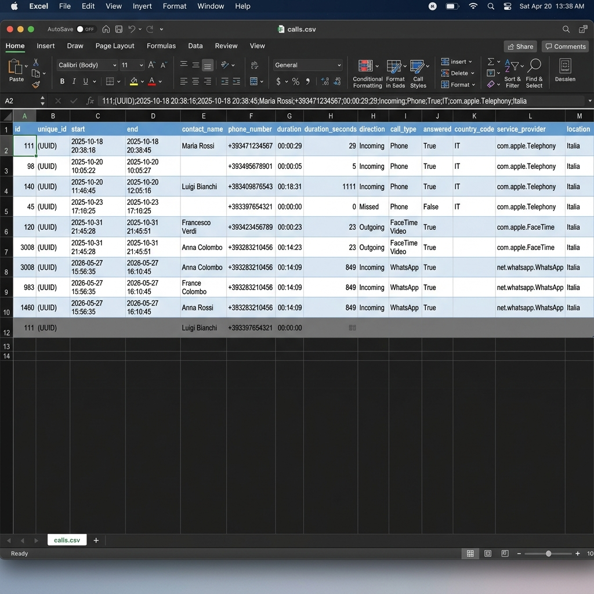

# 📱 iOS Call Exporter

<p align="center">
  
  
  
  
</p>

---

### Language / Lingua
* [🇺🇸 English Version](#-english-version)
* [🇮🇹 Versione Italiana](#-versione-italiana)

---

## 🇺🇸 English Version

**Export your entire iPhone call history directly from your local backups to a beautifully formatted Excel/CSV file.** 

Whether you need to archive your calls for billing purposes, legal requirements, or personal analytics, **iOS Call Exporter** is the most comprehensive, privacy-respecting tool available. It works completely offline, decrypting your iTunes/macOS backups on the fly.

### 🌟 Why Choose iOS Call Exporter?
* 🔒 **100% Privacy-First**: Everything runs locally on your machine. Your backup password and call data never leave your computer.
* 🔍 **Auto Backup Discovery**: No need to manually hunt for backup folders. The app automatically scans default **iTunes/Finder** and **iMazing** backup paths on macOS and Windows, and presents all detected backups sorted by date.
* 📂 **File Explorer (Backup & Live)**: A built-in graphical file manager that lets you browse inside your encrypted backups OR directly inside a connected iOS device via Wi-Fi/USB to extract any file on the fly.
* 📞 **VoIP Support**: It doesn't just export carrier calls. It automatically detects and formats calls from **WhatsApp, Microsoft Teams, FaceTime, Telegram**, and more.
* 📇 **Smart Contact Matching**: Say goodbye to raw phone numbers. The tool parses your iOS address book to seamlessly attach contact names to each call.
* 📊 **Excel-Ready**: Generates a rich CSV tailored to avoid annoying scientific notation in Microsoft Excel, including clean human-readable call durations and international country prefixes.
* 📅 **Google Calendar Sync**: Comes with an optional built-in webhook script to sync your call history directly into your Google Calendar.

---

### 📸 Demo & Interface

#### Modern Desktop App (GUI)
A sleek, dark-mode-ready interface that automatically detects your iPhone backups. Just type your password and click Export!
<p align="center">
  
</p>

#### Clean Excel Output
Beautifully parsed data ready for pivot tables or billing reports.
<p align="center">
  
</p>

#### 📄 Exported CSV — What You Get
Here's a real preview of the exported file opened in Excel. Each row is a call, with all metadata parsed and enriched automatically:
<p align="center">
  
</p>

<details>
<summary><strong>🔍 Raw CSV snippet (click to expand)</strong></summary>

```csv
id;unique_id;start;end;contact_name;phone_number;duration;duration_seconds;direction;call_type;answered;country_code;service_provider;location
111;78FFE58A-...;2025-10-18 20:38:16;2025-10-18 20:38:45;Maria Rossi;="+393471234567";00:00:29;29;Incoming;Phone;True;IT;com.apple.Telephony;Italia
98;21F655FA-...;2025-10-20 10:05:22;2025-10-20 10:05:27;;="+393495678901";00:00:05;5;Incoming;Phone;True;IT;com.apple.Telephony;Italia
45;02EC87D5-...;2025-10-23 17:10:25;2025-10-23 17:10:25;;="+393397654321";00:00:00;0;Missed;Phone;False;IT;com.apple.Telephony;Italia
120;F9060753-...;2025-10-31 21:45:28;2025-10-31 21:45:51;Francesco Verdi;="+393423456789";00:00:23;23;Outgoing;FaceTime Video;True;;com.apple.FaceTime;Italia
3008;7E34EFB5-...;2026-05-27 15:56:35;2026-05-27 16:10:45;Anna Colombo;="+393283210456";00:14:09;849;Incoming;WhatsApp;True;;net.whatsapp.WhatsApp;Italia
```

> **Note:** Phone numbers are wrapped in `="+39..."` to prevent Excel from mangling them with scientific notation.

</details>

---

### 🚀 Quick Start Guide (For Everyone)

Want to get your call history right now? Follow these simple steps:

#### Step 1: Create an Encrypted Backup
Apple requires backups to be encrypted to include your private call history.
1. Connect your iPhone to your Mac/PC with a cable.
2. Open **Finder** (macOS) or **iTunes/Apple Devices** (Windows) and select your iPhone.
3. Check the **"Encrypt local backup"** box and set a password (don't forget it!).
4. Click **"Back Up Now"** and wait for it to finish.

#### Step 2: Download the App
To run this tool, you need **Python 3.14+** and **uv** (a blazing fast Python manager).
1. Download this repository.
2. Open your terminal/command prompt in the downloaded folder.
3. Run this command to install everything automatically:
   ```bash
   uv sync
   ```

#### Step 3: Export!
Launch the graphical interface with:
```bash
uv run python gui.py
```
*The app will automatically find your backup from iTunes/Finder or iMazing. Enter your password, choose where to save the CSV, and you're done!*

> 💡 **Tip:** If you use **iMazing** to manage your iPhone backups, iOS Call Exporter will detect those too — no extra configuration needed.

---

### 💻 Developer Guide (CLI & Automation)

If you prefer the terminal or want to automate the export via cron jobs, you can use the CLI directly.

#### Basic CLI Usage
```bash
uv run python export_calls.py
```
*By default, this script auto-detects the most recent backup from iTunes/Finder or iMazing and outputs `calls.csv`.*

#### 🔍 Automatic Backup Discovery
Both the GUI and CLI automatically scan the following default paths to find valid iOS backups:

| Platform | Source | Path |
|---|---|---|
| **macOS** | iTunes / Finder | `~/Library/Application Support/MobileSync/Backup/` |
| **macOS** | iMazing | `~/Library/Application Support/iMazing/Backups/` |
| **Windows** | iTunes (legacy) | `%APPDATA%\Apple Computer\MobileSync\Backup\` |
| **Windows** | Apple Devices | `%USERPROFILE%\Apple\MobileSync\Backup\` |
| **Windows** | iMazing | `%APPDATA%\iMazing\Backups\` |

Backups are validated by checking for the presence of `Manifest.db` and automatically sorted by modification date (most recent first).

> If your backup is stored in a non-standard location, you can always specify it manually with `--backup-dir` or by clicking "Sfoglia..." (Browse) in the GUI.

#### Advanced Options
```text
--backup-dir PATH    Path to a specific backup directory
--output, -o PATH    Output CSV path (default: calls.csv)
--passphrase TEXT    Backup encryption passphrase (bypasses prompts)
--excel              Format CSV specifically for Excel (semicolon separator)
```

#### Passphrase Automation (`.env` or Keychain)
You can inject the passphrase silently for automated tasks:
1. `BACKUP_PASSPHRASE` in a `.env` file.
2. `OP_BACKUP_REF` in a `.env` file (1Password CLI reference).
3. **macOS Keychain**:
   ```bash
   security add-generic-password -a "$USER" -s "ios-backup-passphrase" -w
   ```

#### Google Calendar Sync Webhook
You can automatically push answered calls to a webhook (like n8n, Make, or Zapier) to sync to Google Calendar.
```bash
cp .env.example .env
# Edit .env and add your WEBHOOK_URL
uv run python send_to_webhook.py --weeks 4
```

---

### 📋 Exported CSV Fields

| Column | Description |
|---|---|
| `start` / `end` | Call times (`YYYY-MM-DD HH:MM:SS`) |
| `contact_name` | Resolved name from AddressBook |
| `phone_number` | Raw identifier (phone or email) |
| `country_prefix` | International code (e.g. `+39`, `+1`) |
| `duration` | Readable format (`HH:MM:SS`) |
| `direction` | `Incoming`, `Outgoing`, or `Missed` |
| `call_type` | `Phone`, `FaceTime`, `Whatsapp`, `Teams`, etc. |

---

### ⚠️ Limitations
- iOS only keeps about ~1,000 recent calls or roughly 1 year of history on the device. Older calls are permanently purged by the system.
- If a contact was deleted before the backup was taken, their name cannot be resolved.
- **You MUST enable Encrypted Backups.** Apple completely strips call history from unencrypted backups for privacy reasons.

---
---

## 🇮🇹 Versione Italiana

**Esporta l'intera cronologia delle chiamate del tuo iPhone direttamente dai tuoi backup locali in un bellissimo file Excel/CSV.**

Che tu abbia bisogno di archiviare le chiamate per scopi di fatturazione, requisiti legali o analisi personali, **iOS Call Exporter** è lo strumento più completo e attento alla privacy disponibile. Funziona completamente offline, decrittografando i tuoi backup di iTunes/macOS in tempo reale.

### 🌟 Perché Scegliere iOS Call Exporter?
* 🔒 **Privacy al 100%**: Tutto viene eseguito localmente sul tuo computer. La password del tuo backup e i dati delle tue chiamate non lasciano mai la tua macchina.
* 🔍 **Rilevamento Automatico dei Backup**: Non serve cercare manualmente le cartelle. L'app scansiona automaticamente i percorsi di default di **iTunes/Finder** e **iMazing** su macOS e Windows, e presenta tutti i backup rilevati ordinati per data.
* 📂 **File Explorer (Backup & Live)**: Un file manager integrato che ti permette di esplorare l'interno dei tuoi backup crittografati OPPURE direttamente la memoria di un dispositivo iOS collegato via Wi-Fi/USB per estrarre qualsiasi file al volo.
* 📞 **Supporto VoIP**: Non esporta solo le chiamate standard. Rileva e formatta automaticamente le chiamate di **WhatsApp, Microsoft Teams, FaceTime, Telegram** e molte altre app.
* 📇 **Riconoscimento Contatti Intelligente**: Dì addio ai numeri di telefono illeggibili. Il tool analizza la tua rubrica iOS per associare il nome corretto a ogni chiamata.
* 📊 **Ottimizzato per Excel**: Genera un file CSV studiato appositamente per evitare la fastidiosa notazione scientifica di Microsoft Excel, includendo durate leggibili e prefissi internazionali.
* 📅 **Sincronizzazione Google Calendar**: Include uno script opzionale per inviare la cronologia chiamate direttamente sul tuo calendario Google.

---

### 📸 Demo e Interfaccia

#### Applicazione Desktop Moderna (GUI)
Un'interfaccia elegante (con tema scuro integrato) che rileva automaticamente i tuoi backup. Inserisci la password ed esporta!
<p align="center">
  
</p>

#### File Excel Pulito e Ordinato
Dati elaborati e pronti per tabelle pivot o report aziendali.
<p align="center">
  
</p>

#### 📄 CSV Esportato — Cosa Otterrai
Ecco un'anteprima reale del file esportato aperto in Excel. Ogni riga rappresenta una chiamata, con tutti i metadati analizzati e arricchiti automaticamente:
<p align="center">
  
</p>

<details>
<summary><strong>🔍 Esempio CSV grezzo (clicca per espandere)</strong></summary>

```csv
id;unique_id;start;end;contact_name;phone_number;duration;duration_seconds;direction;call_type;answered;country_code;service_provider;location
111;78FFE58A-...;2025-10-18 20:38:16;2025-10-18 20:38:45;Maria Rossi;="+393471234567";00:00:29;29;Incoming;Phone;True;IT;com.apple.Telephony;Italia
98;21F655FA-...;2025-10-20 10:05:22;2025-10-20 10:05:27;;="+393495678901";00:00:05;5;Incoming;Phone;True;IT;com.apple.Telephony;Italia
45;02EC87D5-...;2025-10-23 17:10:25;2025-10-23 17:10:25;;="+393397654321";00:00:00;0;Missed;Phone;False;IT;com.apple.Telephony;Italia
120;F9060753-...;2025-10-31 21:45:28;2025-10-31 21:45:51;Francesco Verdi;="+393423456789";00:00:23;23;Outgoing;FaceTime Video;True;;com.apple.FaceTime;Italia
3008;7E34EFB5-...;2026-05-27 15:56:35;2026-05-27 16:10:45;Anna Colombo;="+393283210456";00:14:09;849;Incoming;WhatsApp;True;;net.whatsapp.WhatsApp;Italia
```

> **Nota:** I numeri di telefono sono avvolti in `="+39..."` per impedire a Excel di convertirli in notazione scientifica.

</details>

---

### 🚀 Guida Rapida (Per Tutti gli Utenti)

Vuoi ottenere la tua cronologia chiamate subito? Segui questi tre semplici passaggi:

#### Step 1: Crea un Backup Crittografato
Apple richiede che i backup siano crittografati con password per includere i registri delle chiamate private.
1. Collega l'iPhone al Mac/PC con un cavo.
2. Apri il **Finder** (su macOS) o **iTunes/Dispositivi Apple** (su Windows) e seleziona l'iPhone.
3. Spunta la casella **"Crittografa backup locale"** e imposta una password (scrivitela!).
4. Clicca su **"Effettua backup adesso"** e attendi la fine.

#### Step 2: Scarica il Programma
Per eseguire questo strumento, hai bisogno di **Python 3.14+** e **uv** (un gestore di pacchetti velocissimo).
1. Scarica o clona questo repository.
2. Apri il terminale (o Prompt dei Comandi) nella cartella scaricata.
3. Esegui questo comando per installare tutto automaticamente:
   ```bash
   uv sync
   ```

#### Step 3: Esporta!
Avvia l'interfaccia grafica digitando:
```bash
uv run python gui.py
```
*L'app troverà automaticamente il tuo backup da iTunes/Finder o iMazing. Inserisci la password, scegli dove salvare il CSV, ed è fatta!*

> 💡 **Suggerimento:** Se usi **iMazing** per gestire i backup del tuo iPhone, iOS Call Exporter rileva anche quelli — nessuna configurazione aggiuntiva richiesta.

---

### 💻 Guida per Sviluppatori (CLI e Automazione)

Se preferisci il terminale o vuoi automatizzare l'esportazione, puoi usare direttamente l'interfaccia a riga di comando (CLI).

#### Utilizzo Base della CLI
```bash
uv run python export_calls.py
```
*Di default, lo script rileva l'ultimo backup da iTunes/Finder o iMazing e genera un file `calls.csv`.*

#### 🔍 Rilevamento Automatico dei Backup
Sia la GUI che la CLI scansionano automaticamente i seguenti percorsi per trovare i backup iOS validi:

| Piattaforma | Sorgente | Percorso |
|---|---|---|
| **macOS** | iTunes / Finder | `~/Library/Application Support/MobileSync/Backup/` |
| **macOS** | iMazing | `~/Library/Application Support/iMazing/Backups/` |
| **Windows** | iTunes (legacy) | `%APPDATA%\Apple Computer\MobileSync\Backup\` |
| **Windows** | Apple Devices | `%USERPROFILE%\Apple\MobileSync\Backup\` |
| **Windows** | iMazing | `%APPDATA%\iMazing\Backups\` |

I backup vengono validati controllando la presenza di `Manifest.db` e ordinati automaticamente per data di modifica (il più recente per primo).

> Se il tuo backup si trova in una posizione non standard, puoi sempre specificarlo manualmente con `--backup-dir` oppure cliccando "Sfoglia..." nella GUI.

#### Opzioni Avanzate
```text
--backup-dir PATH    Percorso di un backup specifico
--output, -o PATH    Percorso di output (default: calls.csv)
--passphrase TEXT    Password del backup (evita il prompt interattivo)
--excel              Formatta il CSV appositamente per Excel (usa il punto e virgola)
```

#### Automazione Password (`.env` o Keychain)
Per esecuzioni automatiche puoi passare la password silenziosamente:
1. Variabile `BACKUP_PASSPHRASE` in un file `.env`.
2. Variabile `OP_BACKUP_REF` (per 1Password) in `.env`.
3. **Portachiavi di macOS**:
   ```bash
   security add-generic-password -a "$USER" -s "ios-backup-passphrase" -w
   ```

#### Sincronizzazione Webhook (Google Calendar)
Puoi inviare automaticamente le chiamate risposte a un webhook (es. n8n, Zapier) per sincronizzarle su Google Calendar.
```bash
cp .env.example .env
# Modifica .env e inserisci il tuo WEBHOOK_URL
uv run python send_to_webhook.py --weeks 4
```

---

### 📋 Struttura del CSV Esportato

| Colonna | Descrizione |
|---|---|
| `start` / `end` | Orario inizio/fine (`YYYY-MM-DD HH:MM:SS`) |
| `contact_name` | Nome associato estrapolato dalla rubrica |
| `phone_number` | Numero o email originale |
| `country_prefix` | Prefisso internazionale (es. `+39`) |
| `duration` | Formato leggibile (`HH:MM:SS`) |
| `direction` | `Incoming` (Entrata), `Outgoing` (Uscita), o `Missed` (Persa) |
| `call_type` | `Phone`, `FaceTime`, `Whatsapp`, `Teams`, ecc. |

---

### ⚠️ Limitazioni
- iOS conserva solo le ultime ~1.000 chiamate circa (o circa 1 anno di storico). Le chiamate più vecchie vengono eliminate definitivamente dal sistema operativo.
- Se un contatto è stato cancellato dalla rubrica prima dell'esecuzione del backup, il suo nome non può essere recuperato.
- **DEVI obbligatoriamente abilitare il Backup Crittografato.** Per ragioni di privacy, Apple non inserisce i file del registro chiamate nei backup normali (senza password).
